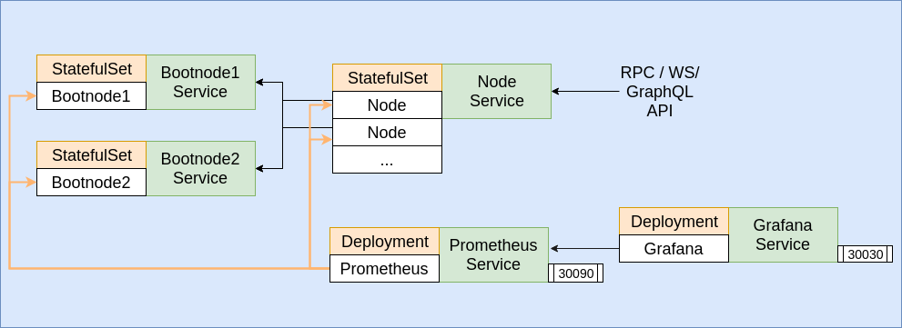

## Flow of the process:
- Create private/public keys for the bootnodes & update the secrets/bootnode-keys-secret.yaml with the bootnode private keys
- Update the configmap/configmap.yml with the public keys
- Update the number of nodes you would like in deployments/node-deployment.yaml
- Run kubectl
- Monitoring via prometheus & grafana is also setup up in a separate *monitoring* namespace and exposed via NodePort services (ports 30090, 30030 respectively)
- Credentials for grafana are admin:admin. When grafana loads up select the "Pantheon Dashboard"

## Overview of Setup


#### 1. Boot nodes private keys
Create private/public keys for the bootnodes using the pantheon subcommands. The private keys are put into secrets and the public keys go into a configmap to get the bootnode enode address easily
Repeat this process for as many bootnodes as you would like to provision i.e keys and replicate the deployment & service

```bash
mkdir -p ./generated_config/bootnode1 ./generated_config/bootnode2
docker run --rm --volume $PWD/generated_config/bootnode1:/opt/pantheon/data pegasyseng/pantheon:develop --data-path /opt/pantheon/data public-key export --to /opt/pantheon/data/key.pub
docker run --rm --volume $PWD/generated_config/bootnode2:/opt/pantheon/data pegasyseng/pantheon:develop --data-path /opt/pantheon/data public-key export --to /opt/pantheon/data/key.pub
```

Update the secrets/bootnode-key-secret.yaml with the private keys. The private keys are put into secrets and the public keys go into a configmap that other nodes use to create the enode address
Update the configmap/configmap.yaml with the public keys
**Note:** Please remove the '0x' prefix of the public keys

#### 2. Genesis.json
Create the genesis.json file and copy its contents into the configmap/configmap as shown

#### 3. Update any more config if required
eg: To alter the number of nodes on the network, alter the `replicas: 2` in the deployments/node-deployments.yaml to suit

#### 4. Deploy:
```bash
kubectl apply -f namespace/monitoring-namespace.yaml
kubectl apply -f rbac/prometheus-rbac.yaml
kubectl apply -f secrets/bootnode-keys-secret.yaml
kubectl apply -f configmap/configmap.yaml
kubectl apply -f configmap/prometheus-configmap.yaml
kubectl apply -f configmap/grafana-configmap.yaml

kubectl apply -f services/bootnode1-service.yaml
kubectl apply -f services/bootnode2-service.yaml
kubectl apply -f services/node-service.yaml
kubectl apply -f services/prometheus-service.yaml
kubectl apply -f services/grafana-service.yaml

kubectl apply -f deployments/bootnode1-deployment.yaml
kubectl apply -f deployments/bootnode2-deployment.yaml
kubectl apply -f deployments/node-deployment.yaml
kubectl apply -f deployments/prometheus-deployment.yaml
kubectl apply -f deployments/grafana-deployment.yaml

# optionally deploy the miner
# kubectl apply -f deployments/minernode-deployment.yaml
```


#### 5. In the dashboard, you will see each bootnode deployment & service, nodes & a node service, miner if enabled, secrets(opaque) and a configmap

If using minikube
```bash
minikube dashboard &
```

#### 6. Verify that the nodes are communicating:
```bash
minikube ssh

# once in the terminal
curl -X POST --data '{"jsonrpc":"2.0","method":"net_peerCount","params":[],"id":1}' <PANTHEON_NODE_SERVICE_HOST>:8545

# which should return:
The result confirms that the node running the JSON-RPC service has two peers:
{
  "jsonrpc" : "2.0",
  "id" : 1,
  "result" : "0x3"
}

```

#### 7. Monitoring
Get the ip that minikube is running on
```bash
minikube ip
```

For example if the ip returned was `192.168.99.100`

*Prometheus:*
In a fresh browser tab open `192.168.99.100:30090` to get to the prometheus dashboard and you can see all the available metrics, as well as the targets that it is collecting metrics for

*Grafana:*
In a fresh browser tab open `192.168.99.100:30030` to get to the grafana dashboard. Credentials are `admin:admin` Open the 'Pantheon Dashboard' to see the status of the nodes on your network. If you do not see the dashboard, click on Dashboards -> Manage and select the dashboard from there


#### 8. Delete
```
kubectl delete -f deployments/
kubectl delete -f services/
kubectl delete -f configmap/
kubectl delete -f secrets/
kubectl delete -f namespace/
```
